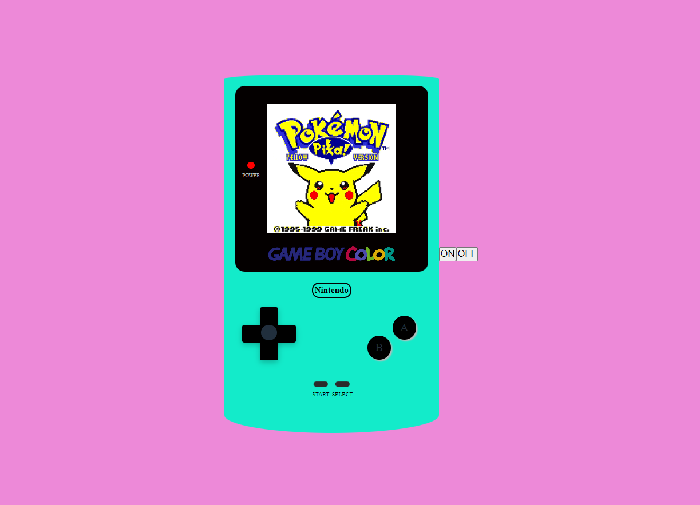

# CSS GAME BOY COLOR
Game Boy Color made with CSS and HTML. It uses some JavaScript to turn on/off the console .    

---

### Overview
A GameBoy illustration created with different CSS styles like flex, shadows  and some HTML. Effects made with a button in HTML and simple code of Javascript.

### Usage 
You can simply run the `index.html` file in your favorite browser and click turn on to play the console.

### License
[MIT](./license)
